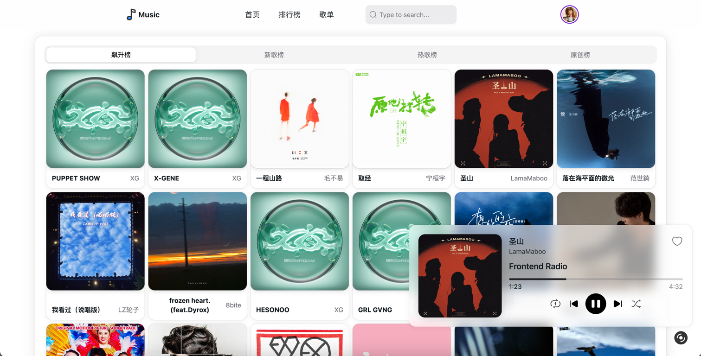

# Next.js Music App

A music app based on nextUI

## Technologies Used

- [Next.js 13](https://nextjs.org/docs/getting-started)
- [NextUI](https://nextui.org)
- [Tailwind CSS](https://tailwindcss.com)
- [Tailwind Variants](https://tailwind-variants.org)
- [TypeScript](https://www.typescriptlang.org)
- [Framer Motion](https://www.framer.com/motion)
- [next-themes](https://github.com/pacocoursey/next-themes)

## Show
**demo:** [music.sleepnow.work](https://music.sleepnow.work)

## License

Licensed under the [MIT license](https://github.com/nextui-org/next-pages-template/blob/main/LICENSE).
